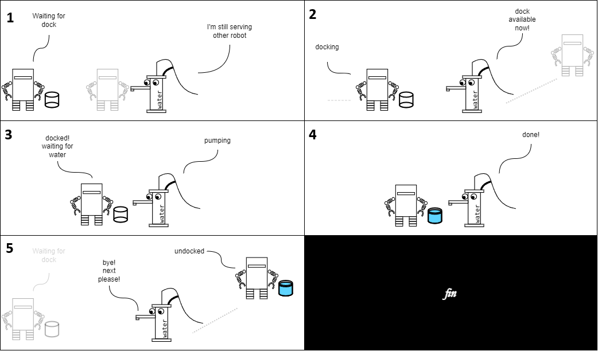

# Implementing a Swarm Workflow

Machine Runner's main purpose is to enable a heterogeneous swarm system (a system of dynamically participating agents of different roles) to work on a swarm workflow.
A swarm workflow in this context is a collection of tasks done by different agents that must be executed in a certain order (aka. sequentially); consequentially, a swarm workflow has a finite lifetime.

Machine Runner enables this by creating a swarm protocol, which can be pictured as an imaginary distributed ledger.
The ledger acts as a coordination point between agents.
An agent who finished a task can write a record on the ledger to let the others know that the system has reached a point where it needs another agent to act.
Agents coordinate with the ledger by writing a record to indicate that the system reached a point where it needs an agent of a certain role to act.

Swarm protocol is imaginary and distributed because it does not possess a single central physical structure.
Instead, it is sustained by its physical representation: events replicated by all agents---or to be more precise Actyx Events replicated by all Actyx Nodes.

## The Thirsty Tomato Plant

Today is a hot day.
On a patch of a farming field, a tomato plant is dry and thirsty.
Now, this farm is fully automated.
There's a sensor, and it senses the tomato's distress.
It signals a robot across the field for water.
Hearing that, the robot rushes to help.
There's a nearby water pump, but it was busy!
A long queue of other robots!
The robot has no choice but to join the queue.

That pump has to serve everyone.
It needs its workspace clean.
It can't have the robots colliding with each other, "not when I'm in charge!".

Let's make this work.
To make sure no robots collide on the pump's workspace the following must happen:
each robot must dock securely;
then, the pump brings in the water;
after being served, the robots leave a safe distance and signal the pump.
Only after that sequence is finished, the next robot can come in.

Such cooperation is often hard, especially in a farming field where a central coordinator is absent.
The pumps and the robots (the agents) must agree on a sequence of tasks.
[They must know who must do what and when](https://en.wikipedia.org/wiki/Race_condition).
To coordinate, they need a protocol.
Fortunately, [`machine-runner`](https://www.npmjs.com/package/@actyx/machine-runner)-on-Actyx exists exactly to solve this problem.



## Prerequisites

Several things are needed before we start:

- Installation of [Actyx](/docs/how-to/local-development/install-actyx)
- Installation of [Actyx Node Manager](/docs/how-to/local-development/install-cli-node-manager)
- Installation of [Node JS](https://nodejs.org/en)
- [Brief introduction to Actyx](/docs/conceptual/overview)

## Setting up the project {#setting-up}

1. Prepare a folder; open a terminal on the folder.

```bash
$ npm init
```

This will prompt you several questions, in which you can fill in the details of your project.

2. Install these dependencies:

```bash
$ npm i typescript @actyx/machine-runner @actyx/sdk uuid @types/uuid
```

`uuid` and `@types/uuid` will be relevant at a later point in this article.

3. Modify `package.json` and `tsconfig.json` with these values:

```json title="package.json"
{
  "scripts": {
    "compile": "tsc",
    "start": "npm run compile && node dist/index.js"
  }
  // ...the rest of package.json
}
```

```json title="tsconfig.json"
{
  "compilerOptions": {
    "outDir": "dist"
    // ...the rest of compilerOptions
  },
  "include": ["src/**/*.*"]
}
```

4. Create a file in `src/index.ts`

```ts title="src/index.ts"
console.log("hello world");
```

5. Finally, we should be able to run the project with:

```bash
$ npm run start
```

## The Robot and The Pump {#robot-and-pump}

In a day of a robot's life:
It stands by, listening to signals from sensors.
A sensor occasionally sends a signal that a tomato plant needs water.
When the robot receives that signal, it finds a nearby pump, draws water, and then runs to water the plant.

To illustrate that in pseudo-code _(no need to type this in)_:

```typescript
// A watering robot's life in a day

async function main() {
  while (true) {
    const taskFromSensor = await receiveSignalFromSensor();
    await waterPlant(taskFromSensor);
  }
}

async function waterPlant(taskFromSensor) {
  const pump = await findNearbyPump();
  await moveTo(pump);
  const dockingId = await requestDockingTo(pump);
  await dockAndDrawWater(dockingId); // <-- the protocol we are working on
  await waterPlant(taskFromSensor);
}
```

At a given time, a pump can have several robots queuing for water.
To prevent collisions, the pump serves one request at a time.

To illustrate (_again, no need to type this in_):

```typescript
// A water pump's life in a day

async function main() {
  while (true) {
    const dockingId = await receiveDockingRequestId();
    await supplyWater(dockingId); // <-- the protocol we are working on
  }
}
```

Within the robot's and the pump's `dockAndDrawWater` and `supplyWater` is a complex workflow.
The workflow involves several activities that involve back-and-forth communication in between.

`dockingId` in the code above uniquely identifies the instance of the workflow.
Each workflow occasion uses a different `dockingId`.
In analogy, `dockingId` serves the same role as the order number on a receipt when ordering a drive-thru.

## Building The Protocol

### Designing the workflow and the interaction {#interaction-design}

First, we want to design how agents coordinate,
in other words, what happens inside `dockAndDrawWater` and `supplyWater`.

On a high level, both agents go through several states: **docking**, **drawing water**, and **undocking**.
For convenience, **initial** and **done** envelop those states.
At one state, a robot may be working while the pump waits;
in the next state it is the pump's turn to work while the robot waits;
therefore the agents need to talk to each other between the states.

With that in mind, we will arrive at this sequence of happenings.

```text
1. robot waits & pump ensures the dock is clear (Initial)
2. pump signals: "dock available"
3. robot docks & pump waits
4. robot signals: "docking successful"
5. robot waits & pump supplies water
6. pump signals: water supplied
7. robot undocks & pump waits
8. robot signals: undock successful
9. (Done)
```

The steps above are interlaced `states` and `events`.
That format is convenient because it can be easily formalized into a state diagram.

<!--
Initial \-\-> Docking: "DockAvailable" by pump
Docking \-\-> DrawingWater: "RobotIsDocked" by robot
DrawingWater \-\-> Undocking: "WaterSupplied" by pump
Undocking \-\-> Done: "RobotIsUndocked" by robot
-->


> **Info**
>
> Those are interacting agents.
> [Why is it not represented in a sequence diagram instead?](./swarm-workflow-state-interaction-duality)

Now that we've figured out the interaction sequence, we can write a protocol with `machine-runner`.

### Working with `machine-runner`

When working with `machine-runner` there are several steps to follow:

1. list the events;
2. make a `swarm protocol`;
3. list the roles;
4. for each role, make a `machine protocol`, and then design the states and the transitions;
5. use the machine

### Listing Events, Making Swarm Protocol

Create a file to collect all events `src/machines/protocol.ts` and then import everything we need from `@actyx/machine-runner`.

```typescript title="src/machines/protocol.ts"
import { MachineEvent, SwarmProtocol } from "@actyx/machine-runner";
```

We have identified the events [while we designed the interaction](#interaction-design).
Write and collect them into a namespace:

```typescript title="src/machines/protocol.ts"
export namespace ProtocolEvents {
  export const DockAvailable =
    MachineEvent.design("DockAvailable").withoutPayload();

  export const RobotIsDocked =
    MachineEvent.design("RobotIsDocked").withoutPayload();

  export const WaterSupplied =
    MachineEvent.design("WaterSupplied").withoutPayload();

  export const RobotIsUndocked =
    MachineEvent.design("RobotIsUndocked").withoutPayload();

  // Collect all events in one array
  // Use `as const` to make it a readonly tuple
  export const All = [
    DockAvailable,
    RobotIsDocked,
    WaterSupplied,
    RobotIsUndocked,
  ] as const;
}
```

Create the swarm protocol; name it `water-drawing-exchange`.

```typescript title="src/machines/protocol.ts"
export const protocol = SwarmProtocol.make(
  "water-drawing-exchange",
  ProtocolEvents.All
);
```

For now, events and the swarm protocol are done.
Let's move to the machine protocol.

### Machine Protocol for The Pump

Create a new file `src/machines/water-pump.ts`, import the protocol, and create a machine protocol.

```typescript title="src/machines/water-pump.ts"
import { ProtocolEvents, protocol } from "./protocol";

export const machine = protocol.makeMachine("WaterPump");
```

An agent has a role in the swarm.
One machine protocol represents exactly one role.
A machine protocol determines how an agent communicates with the swarm and
perceives the swarm workflow's events as various local states, commands, and reactions.

For each state of the workflow from the [interaction design](#interaction-design) create a state.

```typescript title="src/machines/water-pump.ts"
export const ClearingDock = machine
  .designEmpty("ClearingDock")
  .command("dockAvailable", [ProtocolEvents.DockAvailable], () => [{}])
  .finish();

export const WaitingForRobotToDock = machine
  .designEmpty("WaitingForRobotToDock")
  .finish();

export const PumpingWater = machine
  .designEmpty("PumpingWater")
  .command("waterSupplied", [ProtocolEvents.WaterSupplied], () => [{}])
  .finish();

export const WaitingForRobotToUndock = machine
  .designEmpty("WaitingForRobotToUndock")
  .finish();

export const Done = machine.designEmpty("Done").finish();
```

States for the pump are named differently from the workflow counterparts in this tutorial.
The purpose is to reflect how the role perceives the state.
For example, from the perspective of the pump `Docking` is `WaitingForRobotToDock`.
Of course, the naming convention in real use cases will be up to the application programmer.

Commands are defined for the states `ClearingDock` and `PumpingWater`.
This is how we declare that the pump has an active role in this state (i.e. can emit events), per the interaction design.

Last, we need to define the transitions.

```typescript title="src/machines/water-pump.ts"
ClearingDock.react(
  [ProtocolEvents.DockAvailable],
  WaitingForRobotToDock,
  () => undefined
);

WaitingForRobotToDock.react(
  [ProtocolEvents.RobotIsDocked],
  PumpingWater,
  () => undefined
);

PumpingWater.react(
  [ProtocolEvents.WaterSupplied],
  WaitingForRobotToUndock,
  () => undefined
);

WaitingForRobotToUndock.react(
  [ProtocolEvents.RobotIsUndocked],
  Done,
  () => undefined
);
```

### Machine Protocol for The Robot

Create another file for the robot `src/machine/watering-robot.ts` and follow the same process as how we define the pump's machine protocol.

```typescript title="src/machine/watering-robot.ts"
import { ProtocolEvents, protocol } from "./protocol";

export const machine = protocol.makeMachine("WateringRobot");

export const WaitingForAvailableDock = machine
  .designEmpty("WaitingForAvailableDock")
  .finish();

export const Docking = machine
  .designEmpty("Docking")
  .command("docked", [ProtocolEvents.RobotIsDocked], () => [{}])
  .finish();

export const WaitingForWater = machine.designEmpty("WaitingForWater").finish();

export const Undocking = machine
  .designEmpty("Undocking")
  .command("Done", [ProtocolEvents.RobotIsUndocked], () => [{}])
  .finish();

export const Done = machine.designEmpty("Done").finish();

WaitingForAvailableDock.react(
  [ProtocolEvents.DockAvailable],
  Docking,
  () => undefined
);

Docking.react([ProtocolEvents.RobotIsDocked], WaitingForWater, () => undefined);

WaitingForWater.react(
  [ProtocolEvents.WaterSupplied],
  Undocking,
  () => undefined
);

Undocking.react([ProtocolEvents.RobotIsUndocked], Done, () => undefined);
```

Pay attention to which states the robot has commands.
The robot's active states alternate with the pump's active states.
Notice the robot's and the pump's active states.
See how it mirrors the [interaction design](#interaction-design)

### Wrap The Protocols into one

For convenience, let us put all events, swarm protocol, machine protocol, and states in one file: `src/machines/index.ts`:

```typescript title="src/machines/index.ts"
export * as WaterPump from "./water-pump";
export * as WateringRobot from "./watering-robot";
export * as protocol from "./protocol";
```

## Using The Machine Protocol

Recall `dockAndDrawWater` and `supplyWater` in the pseudo-code from [The Robot And The Pump](#robot-and-pump) section.
Now we will implement those functions.
For that, we need two files:

- `src/consumers/water-pump.ts`
- `src/consumers/watering-robot.ts`

### The Pump's Routine

```typescript
export const supplyWater = async (dockingId: string) => {
  // to be implemented
};
```

In those files, import everything we need.

```typescript title="src/consumers/water-pump.ts"
import { createMachineRunner } from "@actyx/machine-runner";
import { Actyx } from "@actyx/sdk"; // we need this to receive an instantiated sdk in our function
import { WaterPump, protocol } from "../machines";

export const supplyWater = async (actyx: Actyx, dockingId: string) => {
  // to be implemented
};
```

Next, create a machine runner.

```typescript title="src/consumers/water-pump.ts"
export const supplyWater = async (actyx: Actyx, dockingId: string) => {
  // ...
  const tag = protocol.protocol.tagWithEntityId(dockingId);
  const machine = createMachineRunner(
    actyx,
    tag,
    WaterPump.ClearingDock,
    undefined
  );
  // ...
};
```

The call `tagWithEntityId(dockingId)` returns a set of tags: `water-drawing-exchange` and `water-drawing-exchange:[dockingId]`;
all events emitted by the `machine` will be tagged those tags;
all events subscribed by the `machine` are also ones tagged with those tags.

In other words, two agents who use a `machine` with the same tag will be able to interact with each other.
This is important, and this will be relevant later.

Now that the pump has an active machine runner, it can interact with the swarm (i.e. everyone participating in the workflow).
To use a machine-runner, we'll use a [for-await](https://developer.mozilla.org/en-US/docs/Web/JavaScript/Reference/Statements/for-await...of)
First the pump should handle the initial state `ClearingDock`.
In that state, the pump does its task and then calls the appropriate command to move the state forward for everyone in the swarm.

```typescript title="src/consumers/water-pump.ts"
export const supplyWater = async (actyx: Actyx, dockingId: string) => {
  const tag = protocol.protocol.tagWithEntityId(dockingId);
  const machine = createMachineRunner(
    actyx,
    tag,
    WaterPump.ClearingDock,
    undefined
  );

  for await (const state of machine) {
    const whenInitial = state.as(WaterPump.ClearingDock);
    if (whenInitial) {
      // In reality, there will be more code here
      // Notice this command call;
      //  it maps directly to the state design phase
      // .command("dockAvailable", ....)
      await whenInitial.commands()?.dockAvailable();
    }
  }
};
```

Now that we've covered all the basics, complete all states handling and add logging code.

<details>
<summary><strong>Final code `src/consumers/water-pump.ts`</strong></summary>

```typescript title="src/consumers/water-pump.ts"
export const supplyWater = async (actyx: Actyx, dockingId: string) => {
  console.log("pump starts task:", dockingId);

  const tag = protocol.protocol.tagWithEntityId(dockingId);
  const machine = createMachineRunner(
    actyx,
    tag,
    WaterPump.ClearingDock,
    undefined
  );

  for await (const state of machine) {
    console.log("pump is:", state.type);

    const whenInitial = state.as(WaterPump.ClearingDock);
    if (whenInitial) {
      await whenInitial.commands()?.dockAvailable();
    }

    const whenPumping = state.as(WaterPump.PumpingWater);
    if (whenPumping) {
      await whenPumping.commands()?.waterSupplied();
    }

    const whenCleared = state.as(WaterPump.Done);
    if (whenCleared) {
      break;
    }
  }

  console.log("pump finishes task:", dockingId);
};
```

</details>

The `for-await` loop will iterate every time the machine detects a change (and only after the previous iteration finished executing).
In one branch, `Done`, the execution breaks out of the `for-await` loop.
This also turns the `machine` off, cutting its connection from Actyx.

This concludes The Pump's part of the bargain.

> **Tip:**
>
> Ideally, local tasks take place before a `command`.
> All connected machine runners will wait for these local tasks before transitioning to the next state.
> Useful in scenarios such as:
>
> - watering robot needs to move to dock before the water pump opens the valve
> - water pump needs to actually provide water before the robot undocks
>
> ```typescript
> // Example
> const whenPumping = state.as(WaterPump.PumpingWater);
> if (whenPumping) {
>   // open the valve, let water out, close after `amountOfWater`
>   await openValveFor(amountOfWater);
>   // after the local task is done, let the robot know
>   await whenPumping.commands()?.waterSupplied();
> }
> ```

### The Robot's Routine

Follow the same pattern as the robot's routine.
However, instead of importing `WaterPump`'s machine protocol, import `WateringRobot` instead.

```typescript title="src/consumers/watering-robot.ts"
import { createMachineRunner } from "@actyx/machine-runner";
import { Actyx } from "@actyx/sdk";
import { WateringRobot, protocol } from "../machines"; // WateringRobot is used instead of WaterPump

export const dockAndDrawWater = async (actyx: Actyx, dockingId: string) => {
  const tag = protocol.protocol.tagWithEntityId(dockingId);
  const machine = createMachineRunner(
    actyx,
    tag,
    WateringRobot.WaitingForAvailableDock,
    undefined
  );
};
```

Cover all states and add logging code.

<details>
<summary><strong>Final code `src/consumers/watering-robot.ts`</strong></summary>

```typescript title="src/consumers/watering-robot.ts"
import { createMachineRunner } from "@actyx/machine-runner";
import { WateringRobot, protocol } from "../machines";
import { Actyx } from "@actyx/sdk";

export const dockAndDrawWater = async (actyx: Actyx, dockingId: string) => {
  console.log("robot starts task:", dockingId);

  const tag = protocol.protocol.tagWithEntityId(dockingId);
  const machine = createMachineRunner(
    actyx,
    tag,
    WateringRobot.WaitingForAvailableDock,
    undefined
  );

  for await (const state of machine) {
    console.log("robot is:", state.type);

    const whenDocking = state.as(WateringRobot.Docking);
    if (whenDocking) {
      await whenDocking.commands()?.docked();
    }

    const whenWaterPumped = state.as(WateringRobot.Undocking);
    if (whenWaterPumped) {
      await whenWaterPumped.commands()?.Done();
    }

    const whenDone = state.as(WateringRobot.Done);
    if (whenDone) {
      break;
    }
  }

  console.log("robot finishes task:", dockingId);
};
```

</details>

This concludes The Robot's part of the bargain.

## Simulating The Cooperative Interaction

We are going to prove that the above code works by running both roles concurrently.

### The simulation code

First, start with a new file `src/index.ts`, and import everything we need

```typescript title="src/index.ts"
import { Actyx } from "@actyx/sdk";
import * as uuid from "uuid";
import { supplyWater } from "./consumers/water-pump";
import { dockAndDrawWater } from "./consumers/watering-robot";

async function main() {
  // code goes here
}

main();
```

Recall that two machine runners with the same tag will be able to interact with each other.
We need the same `dockingId` which will produce the same tag (in this code `dockingId`).
We'll also use pretend manifest to produce two pretend `Actyx` objects.

```typescript title="src/index.ts"
async function main() {
  const APP_MANIFEST = {
    appId: "com.example.tomato-robot",
    displayName: "Tomato Robot",
    version: "1.0.0",
  };

  const sdk1 = await Actyx.of(APP_MANIFEST);
  const sdk2 = await Actyx.of(APP_MANIFEST);
  const dockingId = uuid.v4();
}
```

Next, do the simulation.
Invoke the functions from the robot and the pump with the same `dockingId`, connecting the two.

```typescript title="src/index.ts"
async function main() {
  // ...
  const simulatedPumpPart = supplyWater(sdk1, dockingId);
  const simulatedRobotPart = dockAndDrawWater(sdk2, dockingId);

  await Promise.all([simulatedPumpPart, simulatedRobotPart]);
}
```

At the end of the function, call `dispose` method of `sdk1` and `sdk2` (the `Actyx` objects),
killing all Actyx connections and ending the simulation.

<details>
<summary><strong>Full simulation code</strong></summary>

```typescript title="src/index.ts"
import { Actyx } from "@actyx/sdk";
import * as uuid from "uuid";
import { supplyWater } from "./consumers/water-pump";
import { dockAndDrawWater } from "./consumers/watering-robot";

async function main() {
  const APP_MANIFEST = {
    appId: "com.example.tomato-robot",
    displayName: "Tomato Robot",
    version: "1.0.0",
  };

  const sdk1 = await Actyx.of(APP_MANIFEST);
  const sdk2 = await Actyx.of(APP_MANIFEST);
  const dockingId = uuid.v4();

  // promises
  const simulatedPumpPart = supplyWater(sdk1, dockingId);
  const simulatedRobotPart = dockAndDrawWater(sdk2, dockingId);

  // wait until both processes ends
  await Promise.all([simulatedPumpPart, simulatedRobotPart]);

  sdk1.dispose();
  sdk2.dispose();
}

main();
```

</details>

### Running the simulation

Before running the simulation:

- Make sure [Actyx is running](/docs/how-to/local-development/install-actyx)
- Make sure the [project setup](#setting-up) is done.

When everything is ready, run:

```bash
$ npm run start
```

The following log should appear.
This results from the `console.log` calls we have written.

```txt
pump starts task: a7df8979-cf2b-44a9-996e-1bd93a6fe1ab
robot starts task: a7df8979-cf2b-44a9-996e-1bd93a6fe1ab
pump is: ClearingDock
robot is: WaitingForAvailableDock
pump is: WaitingForRobotToDock
robot is: Docking
pump is: PumpingWater
robot is: WaitingForWater
pump is: WaitingForRobotToUndock
robot is: Undocking
pump is: Done
pump finishes task: a7df8979-cf2b-44a9-996e-1bd93a6fe1ab
robot is: Done
robot finishes task: a7df8979-cf2b-44a9-996e-1bd93a6fe1ab
```

You can see that different agent sees the same state every time (e.g. `ClearingDock/WaitingForAvailableDock`, `WaitingForRobotToDock/Docking`).
This is the behavior guaranteed by using `machine-runner` and `Actyx`.

## Signaling

The simulation assumes that the agents know the `dockingId`,
but how did the agents know the `dockingId` in the first place?
We have left out a small but important process: signaling the request.

Signaling can use events within the protocol, but our protocol's first event is `DockAvailable` which we cannot use since requesting must come before it.

Therefore, let us make some rules:

- a request event is tagged with `water-drawing-exchange-request` because it must be different from the protocol to make sure that it does not interfere with any process inside the protocol.
- a request contains a `dockingId` as its payload
- a `dockingId` is a UUID
- a request is unprocessed if no `water-drawing-exchange:{dockingId}` of type `RobotIsUndocked` exists.
- It is assumed that only 1 pump exists in the environment so the scope of this example-problem does not expand further than what's relevant to the basic usage of machine-runner.

We will implement signaling with [`@actyx/sdk`](https://www.npmjs.com/package/@actyx/sdk) and [`AQL`](https://developer.actyx.com/docs/reference/aql).
`AQL` is a part of Actyx so no additional dependency is needed.

### Signaling Module

Create a file `src/machines/signaling.ts`.
This file will contain the module for both sending and receiving signals.

First, import everything we need: types and modules from `@actyx/sdk` and `uuid` to generate `dockingId`

```typescript title="src/machines/signaling.ts"
import { Actyx, AqlEventMessage, Tag } from "@actyx/sdk";
import * as uuid from "uuid";
```

Then, according to the rules we have invented, write the payload and the tag as a type and a constant.

```typescript title="src/machines/signaling.ts"
type Payload = string;

const REQUEST_TAG = "water-drawing-exchange-request";
```

#### Sending the Request

```typescript title="src/machines/signaling.ts"
export const requestDocking = async (actyx: Actyx) => {
  // The payload
  const dockingId: Payload = uuid.v4();
  await actyx.publish(Tag(REQUEST_TAG).apply(dockingId));
  return dockingId;
};
```

`requestDocking` publishes a `dockingId` as an event to Actyx and returns said `dockingId` to its caller, which is a robot that is initiating a "conversation" with the pump.

`TAG(REQUEST_TAG)` turns a `payload` into a TaggedEvent.
Subsequentially, the same event will be queriable by the `REQUEST_TAG`.

#### Receiving The Request

Next, the pump must be able to query requests it has not served and we will implement this with AQL.

```typescript title="src/machines/signaling.ts"
const AQL = `
PRAGMA features := subQuery interpolation
FROM "${REQUEST_TAG}"
LET done_events := FROM \`water-drawing-exchange:{_}\` FILTER _.type = 'RobotIsUndocked' LIMIT 1 END
FILTER !IsDefined(done_events[0] ?? null)
`.trim();

export const receiveDockingRequestId = async (
  actyx: Actyx
): Promise<string | undefined> =>
  (await actyx.queryAql(AQL))
    .filter((msg): msg is AqlEventMessage => msg.type === "event")
    .map((msg) => msg.payload as Payload)
    .at(0);
```

Above are an AQL and a function that executes it. To paraphrase the AQL:

- Enable beta features: `subQuery` and `interpolation`
- Fetch all events tagged with `REQUEST_TAG`
- Run a subquery and put the result as `done_events`:
  - The subquery fetches one event tagged with `water-drawing-exchange:{_}` and whose type is `RobotIsUndocked`
  - `water-drawing-exchange:{_}` is an interpolation. `{_}` will be replaced by the payload of the parent's event, which we have declared in the previous function to be the `dockingId`
- Filter the events so that only events whose `done_events` counterpart does not exist.

`receiveDockingRequestId` executes the AQL, extracts its payloads, and fetches the first item found.

The AQL and the function fulfill the rule:

> a request is unprocessed if no `water-drawing-exchange:{dockingId}` of type `RobotIsUndocked` exists.

### Simulating The Complete Application

Let us simulate the docking process alongside the signaling.
This will be the more advanced and dynamic version of our previous simulation.

Write the pump's and the robot's complete routine.

<details>
<summary><strong>Code <code>src/simulate-robot.ts</code></strong></summary>

```typescript title="src/simulate-robot.ts"
import { Actyx } from "@actyx/sdk";
import { dockAndDrawWater } from "./consumers/watering-robot";
import { requestDocking } from "./machines/signaling";
import * as uuid from "uuid";

async function main() {
  console.log("robot started");

  const APP_MANIFEST = {
    appId: "com.example.tomato-robot",
    displayName: "Tomato Robot",
    version: "1.0.0",
  };

  const sdk = await Actyx.of(APP_MANIFEST);

  while (true) {
    // randomize which robots issue docking request first
    await sleep(Math.round(Math.random() * 1000));
    const dockingId = await requestDocking(sdk);
    console.log(`dockingId issued`, dockingId);
    await dockAndDrawWater(sdk, dockingId);
  }
}

const sleep = (dur: number) => new Promise((res) => setTimeout(res, dur));

// Monkey patch console log
// So that it is easier to read
const agentId = uuid.v4();
const originalConsoleLog = console.log;
const patchedConsoleLog = (...x: string[]) =>
  originalConsoleLog(`robot:${agentId} :`, ...x);
console.log = patchedConsoleLog;

main();
```

</details>

A robot runs a loop, within which it requests a docking process, and then runs
the machine runner for the `water-drawing-exchange` protocol with the resulting
`dockingId`.

<details>
<summary><strong>Code <code>src/simulate-pump.ts</code></strong></summary>

```typescript title="src/simulate-pump.ts"
import { Actyx } from "@actyx/sdk";
import { supplyWater } from "./consumers/water-pump";
import { receiveDockingRequestId } from "./machines/signaling";

async function main() {
  const APP_MANIFEST = {
    appId: "com.example.tomato-robot",
    displayName: "Tomato Robot",
    version: "1.0.0",
  };

  const sdk = await Actyx.of(APP_MANIFEST);

  while (true) {
    const dockingId = await receiveDockingRequestId(sdk);
    if (!dockingId) {
      console.log("no dockingId found");
      await sleep(1000);
      continue;
    }
    console.log(`dockingId found: ${dockingId}`);
    await supplyWater(sdk, dockingId);
  }
}

const sleep = (dur: number) => new Promise((res) => setTimeout(res, dur));

// Monkey patch console log
// So that it is easier to read
const originalConsoleLog = console.log;
const patchedConsoleLog = (...x: string[]) =>
  originalConsoleLog(`pump :`, ...x);
console.log = patchedConsoleLog;

main();
```

</details>

The pump runs a loop, within which it receives one pending docking request out
of many and then runs the machine runner for the `water-drawing-exchange`
protocol with the resulting `dockingId`.

In this simulation, we will run one pump and two robots.

Install this npm package to make it easy to run concurrent processes.

```bash
npm i concurrently
```

Write the script to run the pump and the two robots.

```json title="package.json"
{
  "scripts": {
    "start-with-signaling": "npm run compile && concurrently \"node dist/simulate-pump\" \"node dist/simulate-robot\" \"node dist/simulate-robot\""
  }
}
```

#### Running the complete simulation

> **Warning:**
>
> Before running this simulation, change the topic of the node to ensure that
> the pump does not handle a request for non-existent robots. Our simulation
> code does not gracefully handle this case right now.
>
> Changing the topic [is easily done with the node-manager](https://developer.actyx.com/docs/reference/node-manager#5-settings).
> In `Nodes > Settings`, change the value of `swarm/topic` with some other random string.

```bash
npm run start-with-signaling
```

The simulation will yield unique results every time it is run.
Watch how the simulation goes, how the pump and the robots interact, and how
requests are done in an ordered manner.

Also, watch how the pump's control flow, a single while loop, also determines how the swarm cooperates.
The pump handles one task and a time, and so the robots take turns interacting with the single pump.
It is done purely with events, without manual coordination between the robots.

<details>
<summary><strong>In one of the runs, this is the result:</code></strong></summary>

```text
[0] pump : no dockingId found
[1] robot:adcda6e1-b318-4cc4-95f1-2e4364edb35d : robot started
[2] robot:0a069632-dbec-4c3c-92c2-d03f7a4e0577 : robot started
```

The pump cannot find any request at first because no one has issued any.
At the same time, the two robots starts.

```text
[1] robot:adcda6e1-b318-4cc4-95f1-2e4364edb35d : dockingId issued da5868b6-95c1-489c-ba18-64dfb0aa1b99
[1] robot:adcda6e1-b318-4cc4-95f1-2e4364edb35d : robot starts task: da5868b6-95c1-489c-ba18-64dfb0aa1b99
[1] robot:adcda6e1-b318-4cc4-95f1-2e4364edb35d : robot is: WaitingForAvailableDock
[2] robot:0a069632-dbec-4c3c-92c2-d03f7a4e0577 : dockingId issued a8b59d73-9c9f-41ac-bde3-0ee7c00b3d3f
[2] robot:0a069632-dbec-4c3c-92c2-d03f7a4e0577 : robot starts task: a8b59d73-9c9f-41ac-bde3-0ee7c00b3d3f
[2] robot:0a069632-dbec-4c3c-92c2-d03f7a4e0577 : robot is: WaitingForAvailableDock
```

Both robots issue their own requests and start their own machine.
Both machine yield `WaitingForAvailableDock`.

```text
[0] pump : dockingId found: da5868b6-95c1-489c-ba18-64dfb0aa1b99
[0] pump : pump starts task: da5868b6-95c1-489c-ba18-64dfb0aa1b99
[0] pump : pump is: ClearingDock
[1] robot:adcda6e1-b318-4cc4-95f1-2e4364edb35d : robot is: Docking
[0] pump : pump is: WaitingForRobotToDock
[1] robot:adcda6e1-b318-4cc4-95f1-2e4364edb35d : robot is: WaitingForWater
[0] pump : pump is: PumpingWater
[1] robot:adcda6e1-b318-4cc4-95f1-2e4364edb35d : robot is: Undocking
[0] pump : pump is: WaitingForRobotToUndock
[1] robot:adcda6e1-b318-4cc4-95f1-2e4364edb35d : robot is: Done
[1] robot:adcda6e1-b318-4cc4-95f1-2e4364edb35d : robot finishes task: da5868b6-95c1-489c-ba18-64dfb0aa1b99
[0] pump : pump is: Done
[0] pump : pump finishes task: da5868b6-95c1-489c-ba18-64dfb0aa1b99
```

The pump find a request (a `dockingId`) and starts its machine for that request.
The pump and the robot `adcda6e1-b318-4cc4-95f1-2e4364edb35d` (whose the request
is received earlier by the pump) cooperate on the task to its completion, when the pump is `ClearingDock` and the robot is `Done`.

```text
[0] pump : dockingId found: a8b59d73-9c9f-41ac-bde3-0ee7c00b3d3f
[0] pump : pump starts task: a8b59d73-9c9f-41ac-bde3-0ee7c00b3d3f
[0] pump : pump is: ClearingDock
[1] robot:adcda6e1-b318-4cc4-95f1-2e4364edb35d : dockingId issued a9778273-c035-49df-8624-6f93729a8636
[1] robot:adcda6e1-b318-4cc4-95f1-2e4364edb35d : robot starts task: a9778273-c035-49df-8624-6f93729a8636
[1] robot:adcda6e1-b318-4cc4-95f1-2e4364edb35d : robot is: WaitingForAvailableDock
```

The pump founds another `dockingId`, meanwhile robot
`adcda6e1-b318-4cc4-95f1-2e4364edb35d` issued another request.

```text
[2] robot:0a069632-dbec-4c3c-92c2-d03f7a4e0577 : robot is: Docking
[0] pump : pump is: WaitingForRobotToDock
[2] robot:0a069632-dbec-4c3c-92c2-d03f7a4e0577 : robot is: WaitingForWater
[0] pump : pump is: PumpingWater
[2] robot:0a069632-dbec-4c3c-92c2-d03f7a4e0577 : robot is: Undocking
[0] pump : pump is: WaitingForRobotToUndock
[0] pump : pump is: Done
[0] pump : pump finishes task: a8b59d73-9c9f-41ac-bde3-0ee7c00b3d3f
[2] robot:0a069632-dbec-4c3c-92c2-d03f7a4e0577 : robot is: Done
[2] robot:0a069632-dbec-4c3c-92c2-d03f7a4e0577 : robot finishes task: a8b59d73-9c9f-41ac-bde3-0ee7c00b3d3f
```

Now the robot `0a069632-dbec-4c3c-92c2-d03f7a4e0577` and the pump works toward
the completion of their task while the other robot,
`adcda6e1-b318-4cc4-95f1-2e4364edb35d`, is waiting for the pump to start
interacting with it.

The rest of the log will show how the robot take turns and the pump work on
requests one by one. This behavior scales regardless of the number robots are
spawned, whether it is 2, 3, 5, etc.

```text
[0] pump : dockingId found: a9778273-c035-49df-8624-6f93729a8636
[0] pump : pump starts task: a9778273-c035-49df-8624-6f93729a8636
[0] pump : pump is: ClearingDock
[2] robot:0a069632-dbec-4c3c-92c2-d03f7a4e0577 : dockingId issued f4949baa-f961-4692-8558-4543fdeb19bd
[2] robot:0a069632-dbec-4c3c-92c2-d03f7a4e0577 : robot starts task: f4949baa-f961-4692-8558-4543fdeb19bd
[2] robot:0a069632-dbec-4c3c-92c2-d03f7a4e0577 : robot is: WaitingForAvailableDock
[0] pump : pump is: WaitingForRobotToDock
[1] robot:adcda6e1-b318-4cc4-95f1-2e4364edb35d : robot is: Docking
[1] robot:adcda6e1-b318-4cc4-95f1-2e4364edb35d : robot is: WaitingForWater
[0] pump : pump is: PumpingWater
[0] pump : pump is: WaitingForRobotToUndock
[1] robot:adcda6e1-b318-4cc4-95f1-2e4364edb35d : robot is: Undocking
[1] robot:adcda6e1-b318-4cc4-95f1-2e4364edb35d : robot is: Done
[1] robot:adcda6e1-b318-4cc4-95f1-2e4364edb35d : robot finishes task: a9778273-c035-49df-8624-6f93729a8636
[0] pump : pump is: Done
[0] pump : pump finishes task: a9778273-c035-49df-8624-6f93729a8636
[0] pump : dockingId found: f4949baa-f961-4692-8558-4543fdeb19bd
[0] pump : pump starts task: f4949baa-f961-4692-8558-4543fdeb19bd
[0] pump : pump is: ClearingDock
[1] robot:adcda6e1-b318-4cc4-95f1-2e4364edb35d : dockingId issued db983ac9-9701-4092-a326-6327d0cf8f0c
[1] robot:adcda6e1-b318-4cc4-95f1-2e4364edb35d : robot starts task: db983ac9-9701-4092-a326-6327d0cf8f0c
[1] robot:adcda6e1-b318-4cc4-95f1-2e4364edb35d : robot is: WaitingForAvailableDock
[2] robot:0a069632-dbec-4c3c-92c2-d03f7a4e0577 : robot is: Docking
[0] pump : pump is: WaitingForRobotToDock
[2] robot:0a069632-dbec-4c3c-92c2-d03f7a4e0577 : robot is: WaitingForWater
[0] pump : pump is: PumpingWater
[0] pump : pump is: WaitingForRobotToUndock
[2] robot:0a069632-dbec-4c3c-92c2-d03f7a4e0577 : robot is: Undocking
[2] robot:0a069632-dbec-4c3c-92c2-d03f7a4e0577 : robot is: Done
[2] robot:0a069632-dbec-4c3c-92c2-d03f7a4e0577 : robot finishes task: f4949baa-f961-4692-8558-4543fdeb19bd
[0] pump : pump is: Done
[0] pump : pump finishes task: f4949baa-f961-4692-8558-4543fdeb19bd
[0] pump : dockingId found: db983ac9-9701-4092-a326-6327d0cf8f0c
[0] pump : pump starts task: db983ac9-9701-4092-a326-6327d0cf8f0c
[0] pump : pump is: ClearingDock
[2] robot:0a069632-dbec-4c3c-92c2-d03f7a4e0577 : dockingId issued 0bbe5224-b13c-4585-8f84-a9510c693e10
[2] robot:0a069632-dbec-4c3c-92c2-d03f7a4e0577 : robot starts task: 0bbe5224-b13c-4585-8f84-a9510c693e10
[2] robot:0a069632-dbec-4c3c-92c2-d03f7a4e0577 : robot is: WaitingForAvailableDock
[0] pump : pump is: WaitingForRobotToDock
[1] robot:adcda6e1-b318-4cc4-95f1-2e4364edb35d : robot is: Docking
[0] pump : pump is: PumpingWater
[1] robot:adcda6e1-b318-4cc4-95f1-2e4364edb35d : robot is: WaitingForWater
[0] pump : pump is: WaitingForRobotToUndock
[1] robot:adcda6e1-b318-4cc4-95f1-2e4364edb35d : robot is: Undocking
[1] robot:adcda6e1-b318-4cc4-95f1-2e4364edb35d : robot is: Done
[1] robot:adcda6e1-b318-4cc4-95f1-2e4364edb35d : robot finishes task: db983ac9-9701-4092-a326-6327d0cf8f0c
[0] pump : pump is: Done
[0] pump : pump finishes task: db983ac9-9701-4092-a326-6327d0cf8f0c
[0] pump : dockingId found: 0bbe5224-b13c-4585-8f84-a9510c693e10
[0] pump : pump starts task: 0bbe5224-b13c-4585-8f84-a9510c693e10
[0] pump : pump is: ClearingDock
[1] robot:adcda6e1-b318-4cc4-95f1-2e4364edb35d : dockingId issued a48601b9-047f-4837-96ff-46474dd27855
[1] robot:adcda6e1-b318-4cc4-95f1-2e4364edb35d : robot starts task: a48601b9-047f-4837-96ff-46474dd27855
[1] robot:adcda6e1-b318-4cc4-95f1-2e4364edb35d : robot is: WaitingForAvailableDock
[0] pump : pump is: WaitingForRobotToDock
[2] robot:0a069632-dbec-4c3c-92c2-d03f7a4e0577 : robot is: Docking
[0] pump : pump is: PumpingWater
[2] robot:0a069632-dbec-4c3c-92c2-d03f7a4e0577 : robot is: WaitingForWater
[0] pump : pump is: WaitingForRobotToUndock
[2] robot:0a069632-dbec-4c3c-92c2-d03f7a4e0577 : robot is: Undocking
[0] pump : pump is: Done
[0] pump : pump finishes task: 0bbe5224-b13c-4585-8f84-a9510c693e10
[2] robot:0a069632-dbec-4c3c-92c2-d03f7a4e0577 : robot is: Done
[2] robot:0a069632-dbec-4c3c-92c2-d03f7a4e0577 : robot finishes task: 0bbe5224-b13c-4585-8f84-a9510c693e10
[0] pump : dockingId found: a48601b9-047f-4837-96ff-46474dd27855
[0] pump : pump starts task: a48601b9-047f-4837-96ff-46474dd27855
[0] pump : pump is: ClearingDock
[2] robot:0a069632-dbec-4c3c-92c2-d03f7a4e0577 : dockingId issued e6db1e06-27a9-4e1e-ae73-877db9b5bee1
[2] robot:0a069632-dbec-4c3c-92c2-d03f7a4e0577 : robot starts task: e6db1e06-27a9-4e1e-ae73-877db9b5bee1
[2] robot:0a069632-dbec-4c3c-92c2-d03f7a4e0577 : robot is: WaitingForAvailableDock
[0] pump : pump is: WaitingForRobotToDock
[1] robot:adcda6e1-b318-4cc4-95f1-2e4364edb35d : robot is: Docking
[1] robot:adcda6e1-b318-4cc4-95f1-2e4364edb35d : robot is: WaitingForWater
[0] pump : pump is: PumpingWater
```

</details>

## Download The Code

The code can be found [here](../examplex/swarm-workflow-example)
