# Interaction-State Duality with Machine-Runner

This document expands the idea of how a set of complex interaction can be represented as a state when formalized with Machine Runner's swarm protocol.
If you haven't read the parent document, please do so [here](../) because this document will use the same example-problem.

## The Problem-Solution as A Sequence

From the problem presented in the [parent document](../) we end up with the following solution, a sequence of local tasks and interactions.

```text
1. robot waits & pump ensures the dock is clear (Initial)
2. pump signals: "dock available"
3. robot docks & pump waits
4. robot signals: "docking successful"
5. robot waits & pump supplies water
6. pump signals: water supplied
7. robot undocks & pump waits
8. robot signals: undock successful
9. (Done)
```

This solution assumes that we are using Machine Runner's swarm protocol so that agents can easily communicate with the entire swarm;
the word signals in the line `pump signals: "dock available` means that an agent (in this case `pump`) sends an event (in this case `dock available`), which is then received by the entire swarm.

### Sequence Diagram

Crudely and directly translated into this sequence diagram.


In the diagram we can see exactly when an agent executes the local task (which does not involve data-exchange with another agents), when it publishes and event, and how the agents cooperate to form a sequential workflow.

> **Note:**
>
> It is important to recall that "Swarm Protocol" here is imaginary and
> distributed in a sense that its existence is not represented by a single
> central physical structure. Instead, its existence is sustained by events
> replicated and owned by each agent.
>
> The diagram only illustrates how the application code perceives the swarm
> protocol.

### Abstracting The Sequence Diagram

There is a pattern within the sequence diagram:
following a state change, only one agent runs a local task and publishes the next event; let us call this agent the active agent or the active participant.
Abstracting agents into active and non-active, we arrive to this diagram:


We now see more clearly of the sequence of interaction:

1. Swarm protocol informs all agents of the workflow's current state.

2. An agent observes the state and decides to "become active".

3. The active agent executes a local task.

4. The active agent communicates with the entire swarm, triggering further change to the workflow's state.

These four steps are repeated for every state change.
On the last repetition, the last three steps are skipped.

Abstracted further, we arrive at this following diagram:


We can then generalize that a swarm workflow is a loop of state change (technically state designation since the first one is not a change), a local task, and an event publication.

### Simplifying The Iteration As State

Now we know that a swarm workflow is a loop of state change, a local task, and an event publication.
The interaction of pattern and the various agents can be deprioritized and we can now focus on the order of state variants within the swarm workflow.

To put it more concretely, we can say the solution workflow for the example-problem involves five states: `Initial`, `Docking`, `DrawingWater`, `Undocking`, `Done`.

And then we can further describe the state, for example: in the `Initial` state, the pump, the active agent executes a local task where it ensures the docks is clear, and then publish `DockAvailable` which them moves the swarm workflow forward to the `Docking` state, and so on.

Therefore we can picture the order of state variants of the workflow with a much more simple state diagram:


